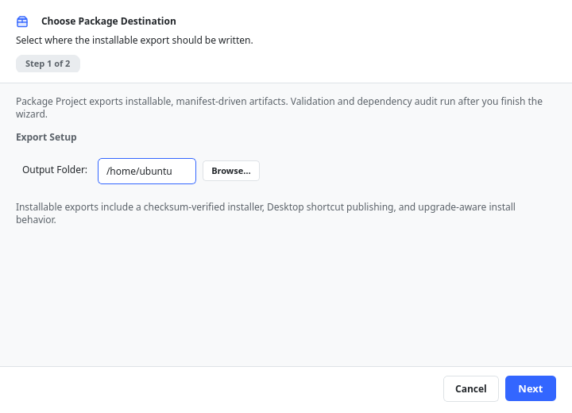

# Packaging, Sharing & Installing

When your project is ready to share or deploy, ChoreBoy Code Studio can package it into an
**installable** artifact that runs on another ChoreBoy appliance. This chapter covers
packaging, what the package contains, and how it is installed.

## The packaging wizard

Start it from the toolbar **Package Project** button, or **Run > Package Project**.

The wizard guides you through a short sequence:

1. **Choose Package Destination.** Pick the **Output Folder** where the package will be
   written. Choose a folder outside your live project.
2. **Review and finish.** The wizard validates the project, runs a dependency audit, and
   writes the package.

> [!IMPORTANT] Always package to a folder **outside** the project being packaged.
> Packaging into the live project would overlap inputs and outputs; the wizard's preflight
> checks catch common problems like this before they cause a confusing failure.

## What the package contains

An installable package is a self-contained folder that includes:

- your project's files and vendored dependencies,
- an **installer** plus the runtime bootstrap files,
- generated documentation,
- `package_manifest.json` describing the package,
- `package_report.json` capturing validation and dependency-audit results.

> [!NOTE] Installable is the only supported package profile. The earlier "portable"
> profile has been retired.

## Installing the package on an appliance

1. Copy the package folder onto the target machine (for example, to `/home/default/`).
2. Double-click the installer's desktop launcher.
3. The installer verifies the package, copies files into the chosen install directory,
   and can publish a Desktop shortcut for the installed application.

The installer launcher locates itself by the package folder path. If you move the package
folder before installing, the launcher's path must match the new location.

## Upgrades

If you install a newer version of a package that is already installed, the installer can
detect the older version and offer to clean it up or install side by side. This keeps
upgrades predictable without relying on hidden, app-owned metadata.

## Backups and portability

Because a project is just a folder, you do not need packaging to back it up:

- Copy the whole project folder to a USB drive, or
- Zip the folder and store it somewhere safe.

Use packaging when you want a clean, installable build for another machine; use a plain
folder copy or zip for everyday backups.

> [!IMPORTANT] Keep regular backups on a USB drive. Power interruptions and accidents
> happen; your projects are your files.

## What gets written to your project

Packaging does not modify your source code. It only writes packaging metadata to
`cbcs/package.json` so the next package build can reuse your choices.

## Where to go next

- Make sure dependencies are present before packaging — see "Managing dependencies".
- Understand packaging preflight messages in "Troubleshooting by symptom".
