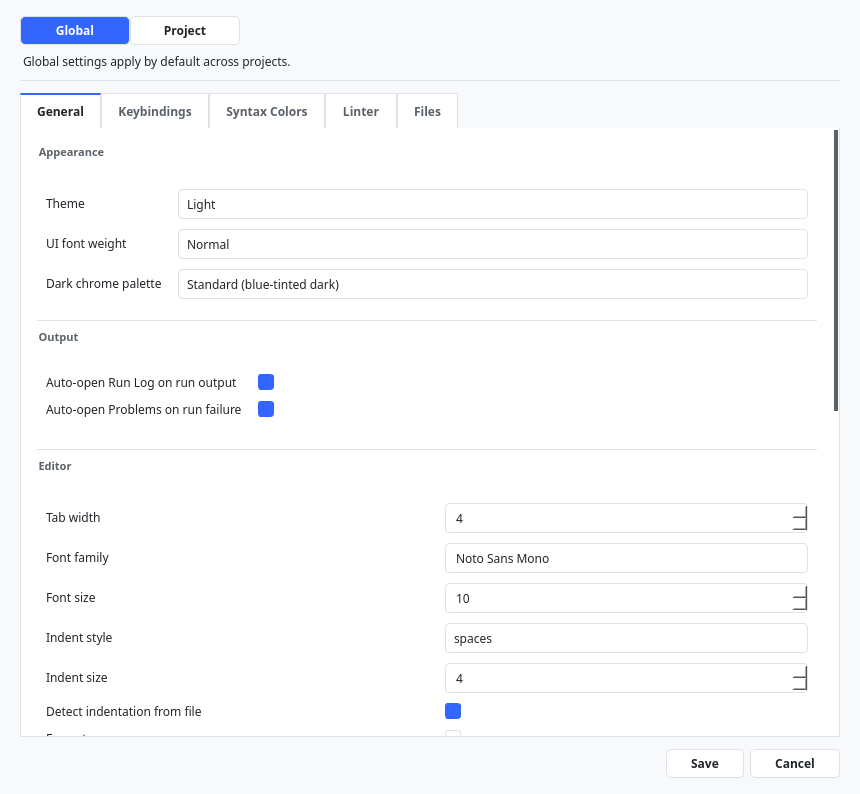
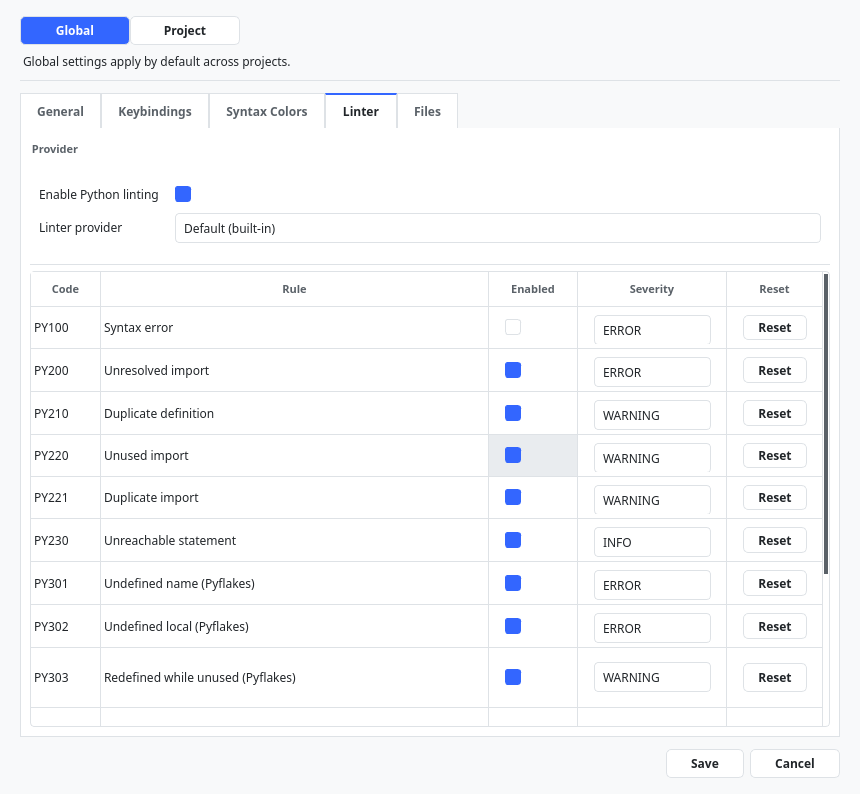
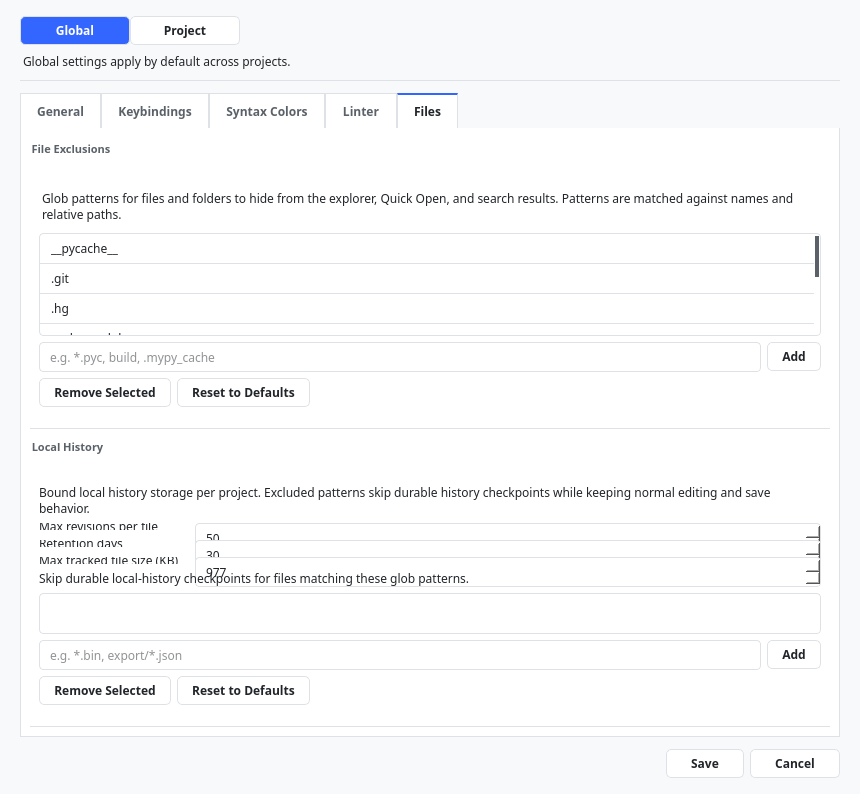
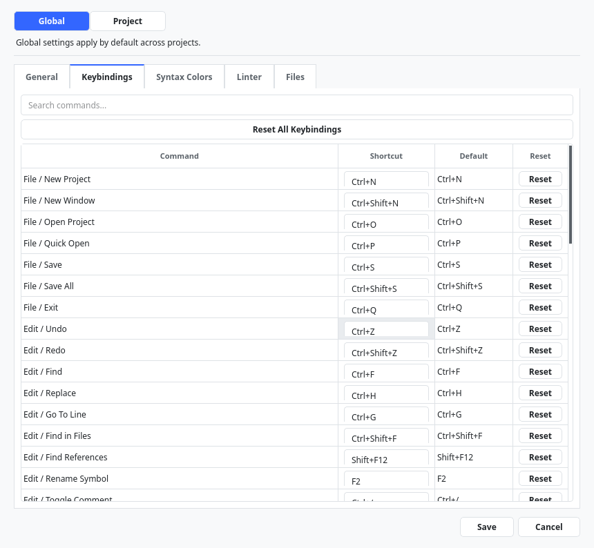
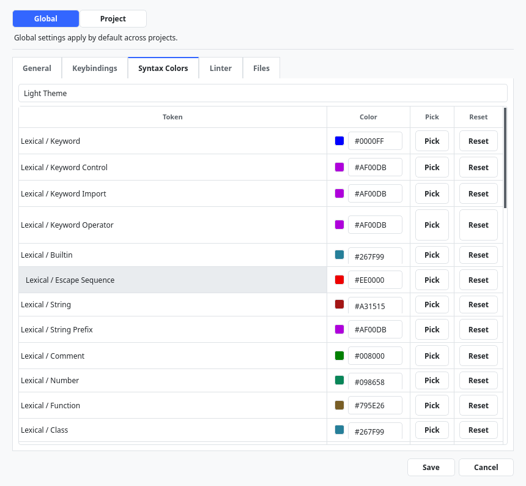

# Every Settings Tab & Field

This chapter documents every setting in the Settings dialog, organized by tab, with its
default value and whether it can be overridden per project. Open Settings with
**File > Settings...**.

> [!NOTE] "Project-overridable" means the setting can differ per project. Settings marked
> global-only describe your machine or account and apply everywhere.

## General tab

The General tab is a single scrolling page that collects four groups: **Appearance**
(global-only), **Output**, **Editor**, and **Intelligence** (all project-overridable).
There is no separate "Intelligence" tab — its settings live in this group at the bottom
of the General tab.

### Appearance (global-only)

| Setting | Default | Description |
| --- | --- | --- |
| Theme | System | The color theme: System, Light, Dark, High Contrast Light, High Contrast Dark. |
| UI font weight | Normal | Weight of interface text: Normal, Medium, or Bold. |
| Dark chrome palette | Standard (blue-tinted dark) | In Dark mode, choose Standard or Neutral gray dark. |

### Output (project-overridable)

| Setting | Default | Description |
| --- | --- | --- |
| Auto-open Run Log on run output | On | Switch to the Run Log when a run produces output. |
| Auto-open Problems on run failure | On | Switch to the Problems panel when a run fails. |

### Editor (project-overridable)

| Setting | Default | Description |
| --- | --- | --- |
| Tab width | 4 | Display width of a tab character. |
| Font family | monospace | Editor font. |
| Font size | 10 | Editor font size. |
| Indent style | spaces | Insert spaces or tabs when indenting. |
| Indent size | 4 | Number of spaces per indent level. |
| Detect indentation from file | On | Match the opened file's existing indentation. |
| Format on save | Off | Run Black when saving a Python file. |
| Organize imports on save | Off | Sort imports when saving a Python file. |
| Trim trailing whitespace on save | On | Remove trailing spaces on save. |
| Insert final newline on save | On | Ensure the file ends with a newline. |
| Enable preview tabs | On | Single-click opens a temporary preview tab. |
| Auto save | Off | Save changes automatically. |
| Exit behavior | Ask | On exit with unsaved changes: ask, or keep unsaved for next launch. |
| Hover tooltip enabled | Off | Show documentation tooltips on hover. |
| Auto re-indent flat-Python paste | Off | Automatically fix indentation of pasted flat Python (high-confidence cases). |

### Intelligence (project-overridable)

The Intelligence group (at the bottom of the General tab) controls code completion,
diagnostics behavior, quick fixes, and the symbol index.

| Setting | Default | Description |
| --- | --- | --- |
| Enable completion | On | Offer code completion. |
| Auto-trigger completion | Off | Show completions automatically while typing. |
| Completion min chars | 2 | Characters typed before auto-completion triggers. |
| Realtime diagnostics | On | Update problems as you type. |
| Enable quick fixes | On | Offer automatic fixes for problems. |
| Preview required for multi-file fixes | On | Preview before applying fixes that touch several files. |
| Enable intelligence cache | On | Use the symbol index cache for speed. |
| Incremental indexing | On | Update the symbol index incrementally. |
| Metrics logging | On | Log intelligence performance metrics. |
| Force full reindex on open | Off | Rebuild the whole index when a project opens. |

> [!NOTE] Whether diagnostics appear at all is governed by **Enable Python linting** on
> the Linter tab (below), not by this group. Large-file syntax-highlighting thresholds
> are tuned automatically and are not exposed as editable fields in this dialog.

## Linter tab (project-overridable)

| Setting | Default | Description |
| --- | --- | --- |
| Enable Python linting | On | Turn linting on or off. When off, provider and rule controls are disabled. |
| Provider | Default (built-in) | Choose the lint backend: Default (built-in) or Pyflakes. |
| Rule overrides | (none) | Enable/disable individual rules and set their severity. |

Rule overrides let you, for example, disable an "unused import" rule (such as `PY220`)
or change a rule's severity to a warning. In project scope, each override offers
**Reset to Global**. See "Linting & the Problems panel" for the rule catalog.

## Files tab (project-overridable)

The Files tab has two groups: **File Exclusions** and **Local History**.

### File Exclusions

| Setting | Default | Description |
| --- | --- | --- |
| Exclude patterns | (project-dependent) | Glob patterns for files/folders hidden from the Explorer, Quick Open, and search (for example, `vendor`, `__pycache__`, `*.sqlite3`). Add, remove, or **Reset to Defaults**. |

### Local History

Controls how much Local History is kept. See "Local History & recovery".

| Setting | Default | Description |
| --- | --- | --- |
| Max revisions per file | 50 | How many saved revisions to keep per file. |
| Retention days | 30 | How long to keep history entries. |
| Max tracked file size (KB) | ~977 KB | Files larger than this are not tracked (stored internally as bytes). |
| Exclude patterns | (none) | Files matching these patterns skip durable history checkpoints. |

## Keybindings tab (global-only)

Lists every command with its current shortcut, grouped by category (File, Edit, Run,
View, Tools). Click a shortcut to record a new key combination. Conflicts are detected
and must be resolved. See "Keyboard shortcuts" for the full default table.

## Syntax Colors tab (global-only)

Customize the color of each syntax token. A scope dropdown offers four independent
palettes:

- **Light Theme**
- **Dark Theme**
- **High Contrast Light**
- **High Contrast Dark**

Overrides in one scope do not affect the others. See "Themes in depth".

## Recommended starting settings

These are sensible defaults to turn on once you are comfortable:

| Setting | Suggested value | Why |
| --- | --- | --- |
| Format on save | On | Keeps every file consistently Black-formatted. |
| Organize imports on save | On | Keeps imports tidy without thinking about it. |
| Auto-trigger completion | On (if you like live suggestions) | Faster coding once you are used to it. |
| Real-time diagnostics | On (default) | Catch problems as you type. |
| Theme | Whatever is comfortable; High Contrast for max legibility | Reduces eye strain. |

Leave the rest at their defaults until you have a reason to change them.

## Settings that work together

A few settings interact:

- **Format on save** + **Organize imports on save** combine into one save-time transform.
  If either fails, the file is still saved and you get a warning.
- **Indent style/size** and **Detect indentation from file**: when detection is on, an
  opened file's existing style takes precedence over your configured size, so you do not
  fight a file's conventions.
- **Linter > Enable Python linting** gates the whole Problems experience; **Realtime
  diagnostics** (General > Intelligence) only controls *when* they update.
- **Linter > Enable** gates the provider and rule-override controls; turning linting off
  disables them.

## Per-project vs global, at a glance

| Tab → group | Per-project? |
| --- | --- |
| General → Appearance | Global only |
| General → Output, Editor, Intelligence | Project-overridable |
| Linter | Project-overridable |
| Files → File Exclusions, Local History | Project-overridable |
| Keybindings | Global only |
| Syntax Colors | Global only |

## Where settings are stored

- Global: `~/choreboy_code_studio_state/settings.json`
- Project: `<project>/cbcs/settings.json`

Both are plain JSON. The exact keys are listed in Part V, "File & folder reference".
