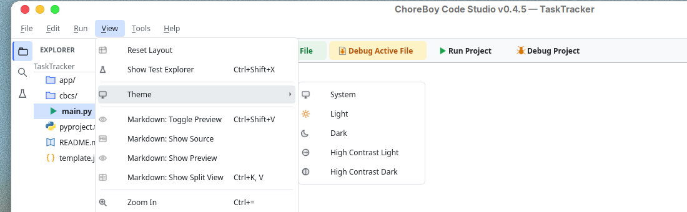
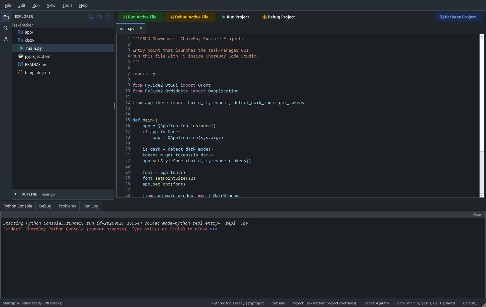

# Themes in Depth

ChoreBoy Code Studio ships five theme modes, including two high-contrast modes, plus
per-theme syntax color customization. This chapter covers all of them.

## Choosing a theme

Open **View > Theme** and pick a mode.

| Mode | Description |
| --- | --- |
| **System** | Follow the desktop's light/dark preference. |
| **Light** | A light interface. |
| **Dark** | A dark interface. |
| **High Contrast Light** | Pure-white surfaces with very high contrast (WCAG AAA). |
| **High Contrast Dark** | Pure-black surfaces with very high contrast (WCAG AAA). |

Your choice is saved globally and applies immediately, without restarting. You can also
set it in **Settings > General > Appearance > Theme**.

Here is the editor in **Dark** mode:

## High Contrast modes

The two High Contrast modes are designed for maximum legibility:

- **High Contrast Light** uses pure-white (`#FFFFFF`) editor and panel backgrounds with
  near-black text.
- **High Contrast Dark** uses pure-black (`#000000`) backgrounds with white text.
- Focus rings are drawn thicker in High Contrast modes, so the focused control is
  obvious.

Every panel, dialog, menu, and indicator is tuned for these modes — nothing falls back to
the standard palette.

## The dark chrome palette

In standard **Dark** mode you can choose how the window "chrome" (panels and surfaces)
looks, in **Settings > General > Appearance > Dark chrome palette**:

- **Standard (blue-tinted dark)** — the default, with subtly blue-tinted dark surfaces.
- **Neutral gray dark** — neutral gray surfaces, keeping the blue accent for focus rings,
  links, and the runtime-ready indicator.

This setting only affects standard Dark mode; Light and High Contrast modes ignore it.

## UI font weight

Also under **Settings > General > Appearance**, **UI font weight** lets you choose
Normal, Medium, or Bold interface text.

## Customizing syntax colors

You can recolor individual code tokens (keywords, strings, comments, and so on) in
**Settings > Syntax Colors**. A scope dropdown offers four independent palettes:

- **Light Theme**
- **Dark Theme**
- **High Contrast Light**
- **High Contrast Dark**

Each scope is independent: an override you set for High Contrast Dark does not affect the
standard Dark palette. Overrides persist across restarts.

> [!TIP] If you change a token color and it looks wrong, you can clear the override to
> return to the theme's default color for that token.

## Readability is preserved

All themes are designed so that diagnostics (error/warning/info squiggles), the debug
current-line highlight, search-match highlights, and test pass/fail indicators stay
distinguishable. When you customize colors, keep contrast high enough to remain readable.

## Where to go next

- Change every other setting in "Every settings tab & field".
- Customize keyboard shortcuts in "Keyboard shortcuts".
