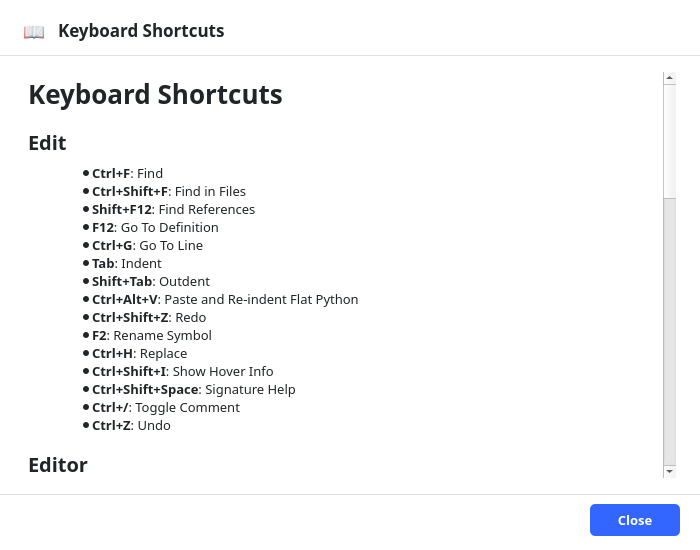

# Keyboard Shortcuts

This chapter lists the default keyboard shortcuts and explains how to customize them. You
can also view shortcuts in the application via **Help > Keyboard Shortcuts**.

## The essential ten

If you learn only ten shortcuts, learn these — they cover the daily loop:

| Shortcut | Action |
| --- | --- |
| `Ctrl+P` | Open any file by name (Quick Open) |
| `Ctrl+S` | Save |
| `Ctrl+F` | Find in this file |
| `Ctrl+Shift+F` | Find in all files |
| `F5` | Run active file |
| `Shift+F5` | Run project |
| `Shift+F2` | Stop |
| `F12` | Go to definition |
| `F2` | Rename symbol |
| `Ctrl+/` | Toggle comment |

Everything else you can look up below or learn over time.

## Customizing shortcuts

Open **File > Settings... > Keybindings** (global scope). The Keybindings tab lists every
customizable command, grouped by category, with its current shortcut.

1. Click a command's shortcut.
2. Press the new key combination.
3. **Save**.

Conflicts (assigning a combination already in use) are detected and must be resolved.
Custom shortcuts persist across restarts and apply immediately to menus and actions.

> [!NOTE] Shortcuts are a global setting — they apply to every project, not per project.

## File

| Command | Default |
| --- | --- |
| New Project | `Ctrl+N` |
| New Window | `Ctrl+Shift+N` |
| Open Project | `Ctrl+O` |
| Quick Open | `Ctrl+P` |
| Save | `Ctrl+S` |
| Save All | `Ctrl+Shift+S` |
| Exit | `Ctrl+Q` |

## Edit

| Command | Default |
| --- | --- |
| Undo | `Ctrl+Z` |
| Redo | `Ctrl+Shift+Z` |
| Find | `Ctrl+F` |
| Replace | `Ctrl+H` |
| Go To Line | `Ctrl+G` |
| Find in Files | `Ctrl+Shift+F` |
| Find References | `Shift+F12` |
| Rename Symbol | `F2` |
| Toggle Comment | `Ctrl+/` |
| Indent | `Tab` |
| Outdent | `Shift+Tab` |
| Paste and Re-indent Flat Python | `Ctrl+Alt+V` |
| Go To Definition | `F12` |
| Signature Help | `Ctrl+Shift+Space` |
| Show Hover Info | `Ctrl+Shift+I` |

## Run & Debug

| Command | Default |
| --- | --- |
| Run Active File | `F5` |
| Debug Active File | `Ctrl+F5` |
| Run Project | `Shift+F5` |
| Debug Project | `Ctrl+Shift+F5` |
| Run With Arguments | `Ctrl+Shift+A` |
| Run Project Tests | `Ctrl+Shift+T` |
| Run Current File Tests | `Ctrl+Alt+T` |
| Debug Current Test | `Ctrl+Alt+Shift+T` |
| Stop | `Shift+F2` |
| Restart | `Ctrl+Shift+F2` |
| Rerun Last Debug Target | `Ctrl+Shift+F6` |
| Continue | `F6` |
| Pause | `Ctrl+F6` |
| Step Over | `F10` |
| Step Into | `F11` |
| Step Out | `Shift+F11` |
| Toggle Breakpoint | `F9` |
| Restart Python Console | `` Ctrl+` `` |

## View

| Command | Default |
| --- | --- |
| Show Test Explorer | `Ctrl+Shift+X` |
| Zoom In | `Ctrl+=` |
| Zoom Out | `Ctrl+-` |
| Reset Zoom | `Ctrl+0` |
| Markdown: Toggle Preview | `Ctrl+Shift+V` |
| Markdown: Show Split View | `Ctrl+K, V` |

## Tools

| Command | Default |
| --- | --- |
| Go to Symbol in File | `Ctrl+R` |

## Explorer (project tree)

| Command | Default |
| --- | --- |
| Rename Project Item | `F2` |
| Copy Project Item | `Ctrl+C` |
| Cut Project Item | `Ctrl+X` |
| Paste Project Item | `Ctrl+V` |
| Move Project Item to Trash | `Delete` |

## Editor tabs

| Command | Default |
| --- | --- |
| Close Tab | `Ctrl+W` |
| Keep Preview Tab Open | `Ctrl+K, Enter` |

> [!NOTE] Some commands (for example, several Markdown view modes and Run Test at Cursor)
> have no default shortcut but can be assigned one in the Keybindings settings.

## Where to go next

- A one-page summary is in Appendix A, "Quick-reference cheat sheet".
- Change other preferences in "Every settings tab & field".
