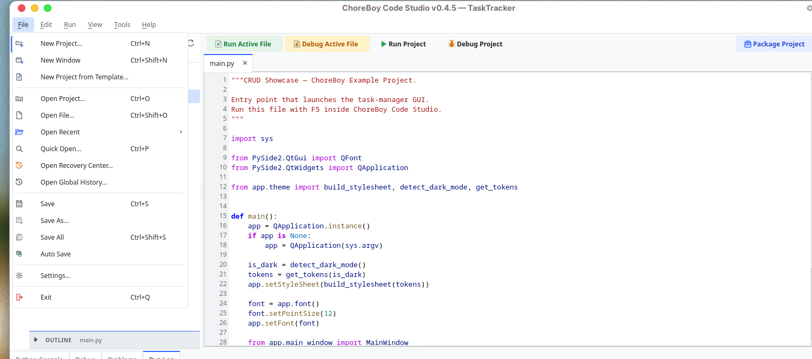
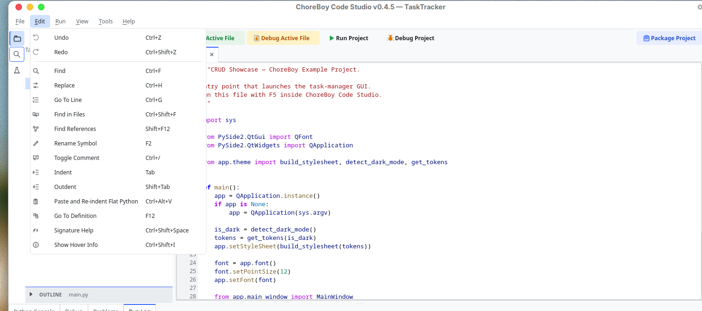
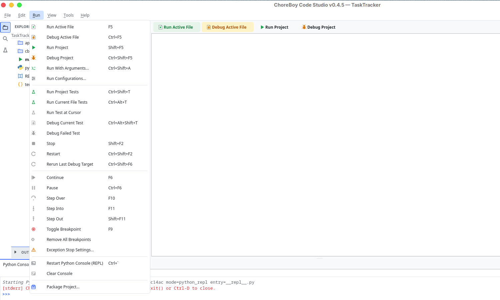
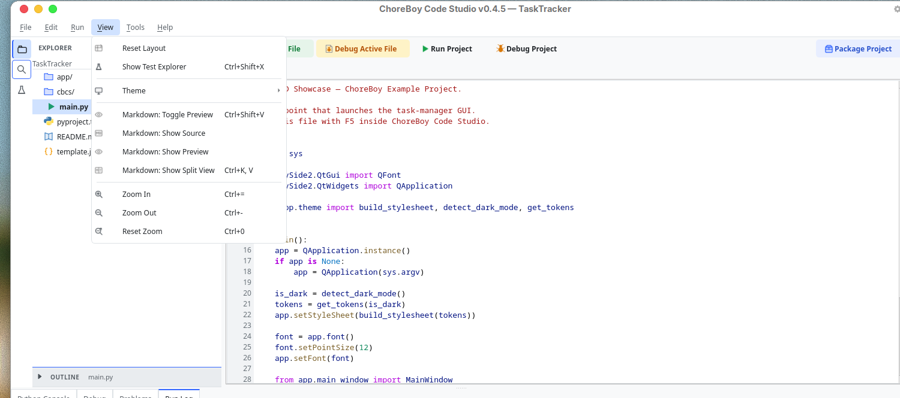
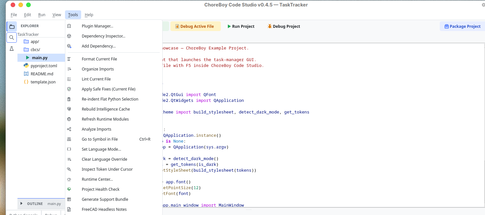
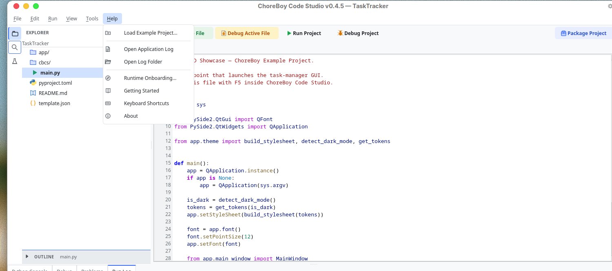

# Menu & Command Reference

This chapter is an exhaustive reference for every command in the menu bar. Each table
lists the command, its default keyboard shortcut (if any), and what it does. Default
shortcuts can be changed in **Settings > Keybindings** (see "Keyboard shortcuts").

> [!NOTE] Some commands are only enabled in the right context — for example, debug
> stepping commands are enabled only while a debug session is paused, and Markdown view
> commands apply only to Markdown files.

## File menu

| Command | Shortcut | Description |
| --- | --- | --- |
| New Project... | `Ctrl+N` | Create a new project, choosing a name and location. |
| New Window | `Ctrl+Shift+N` | Open a second editor window. |
| New Project from Template... | — | Create a project from a template (Qt App, Headless Tool, Utility Script). |
| Open Project... | `Ctrl+O` | Open an existing project folder. |
| Open File... | `Ctrl+Shift+O` | Open a single file. |
| Open Recent | — | Submenu of recently opened projects. |
| Quick Open... | `Ctrl+P` | Jump to any project file by typing part of its name. |
| Open Recovery Center... | — | Review and restore autosaved drafts after a crash. |
| Open Global History... | — | Search Local History across all files, including deleted ones. |
| Save | `Ctrl+S` | Save the active file. |
| Save As... | — | Save the active file under a new name. |
| Save All | `Ctrl+Shift+S` | Save every modified file. |
| Auto Save | — | Toggle automatic saving of drafts. |
| Settings... | — | Open the Settings dialog. |
| Exit | `Ctrl+Q` | Close the application. |

## Edit menu

| Command | Shortcut | Description |
| --- | --- | --- |
| Undo | `Ctrl+Z` | Undo the last edit. |
| Redo | `Ctrl+Shift+Z` | Redo the last undone edit. |
| Find | `Ctrl+F` | Find text in the active file. |
| Replace | `Ctrl+H` | Find and replace text in the active file. |
| Go To Line | `Ctrl+G` | Jump to a line number. |
| Find in Files | `Ctrl+Shift+F` | Search text across the whole project. |
| Find References | `Shift+F12` | Find all uses of the symbol under the cursor. |
| Rename Symbol | `F2` | Rename a symbol across the project (semantic rename). |
| Toggle Comment | `Ctrl+/` | Comment or uncomment the selected lines. |
| Indent | `Tab` | Increase indentation of the selection. |
| Outdent | `Shift+Tab` | Decrease indentation of the selection. |
| Paste and Re-indent Flat Python | `Ctrl+Alt+V` | Paste clipboard text and fix flattened Python indentation. |
| Go To Definition | `F12` | Jump to where the symbol under the cursor is defined. |
| Signature Help | `Ctrl+Shift+Space` | Show the call signature for the function at the cursor. |
| Show Hover Info | `Ctrl+Shift+I` | Show documentation for the symbol under the cursor. |

## Run menu

| Command | Shortcut | Description |
| --- | --- | --- |
| Run Active File | `F5` | Run the file in the active editor tab. |
| Debug Active File | `Ctrl+F5` | Debug the active file. |
| Run Project | `Shift+F5` | Run the project's configured entry file. |
| Debug Project | `Ctrl+Shift+F5` | Debug the project entry file. |
| Run With Arguments... | `Ctrl+Shift+A` | Run once with custom arguments, working directory, and environment. |
| Run Configurations... | — | Create and edit named run configurations. |
| Run Project Tests | `Ctrl+Shift+T` | Run all tests in the project with pytest. |
| Run Current File Tests | `Ctrl+Alt+T` | Run the tests in the active file. |
| Run Test at Cursor | — | Run the single test function at the cursor. |
| Debug Current Test | `Ctrl+Alt+Shift+T` | Debug the tests in the active file. |
| Debug Failed Test | — | Debug the first previously failed test. |
| Stop | `Shift+F2` | Stop the running program or debug session. |
| Restart | `Ctrl+Shift+F2` | Stop and run again. |
| Rerun Last Debug Target | `Ctrl+Shift+F6` | Repeat the most recent debug launch. |
| Continue | `F6` | Resume a paused debug session. |
| Pause | `Ctrl+F6` | Pause a running debug session. |
| Step Over | `F10` | Execute the current line, not stepping into calls. |
| Step Into | `F11` | Step into the function call on the current line. |
| Step Out | `Shift+F11` | Run until the current function returns. |
| Toggle Breakpoint | `F9` | Add or remove a breakpoint on the current line. |
| Remove All Breakpoints | — | Clear every breakpoint in the project. |
| Exception Stop Settings... | — | Choose whether the debugger pauses on raised/uncaught exceptions. |
| Restart Python Console (REPL) | `` Ctrl+` `` | Restart the interactive Python Console. |
| Clear Console | — | Clear the Run Log / console output. |
| Package Project | — | Open the packaging wizard. |

## View menu

| Command | Shortcut | Description |
| --- | --- | --- |
| Reset Layout | — | Restore the default arrangement of panels. |
| Show Test Explorer | `Ctrl+Shift+X` | Open the Test Explorer in the sidebar. |
| Theme | — | Submenu: System, Light, Dark, High Contrast Light, High Contrast Dark. |
| Markdown: Toggle Preview | `Ctrl+Shift+V` | Toggle the Markdown preview for the active file. |
| Markdown: Show Source | — | Show only the Markdown source. |
| Markdown: Show Preview | — | Show only the rendered Markdown preview. |
| Markdown: Show Split View | `Ctrl+K, V` | Show source and preview side by side. |
| Zoom In | `Ctrl+=` | Increase the editor font size. |
| Zoom Out | `Ctrl+-` | Decrease the editor font size. |
| Reset Zoom | `Ctrl+0` | Return to the default font size. |

## Tools menu

| Command | Shortcut | Description |
| --- | --- | --- |
| Plugin Manager... | — | Install, enable, disable, and remove plugins. |
| Dependency Inspector... | — | View and manage the project's vendored dependencies. |
| Add Dependency... | — | Add a Python package from a local wheel, zip, or folder. |
| Format Current File | — | Reformat the active Python file with Black. |
| Organize Imports | — | Sort and group the imports in the active Python file. |
| Lint Current File | — | Run the linter on the active file. |
| Apply Safe Fixes (Current File) | — | Apply automatic, safe lint fixes. |
| Re-indent Flat Python Selection | — | Fix indentation of a flattened Python selection. |
| Rebuild Intelligence Cache | — | Rebuild the symbol index used by code intelligence. |
| Refresh Runtime Modules | — | Re-probe which runtime modules are importable. |
| Analyze Imports | — | Check the active file's imports for problems. |
| Go to Symbol in File | `Ctrl+R` | Jump to a function or class in the active file. |
| Set Language Mode... | — | Override the syntax highlighting language for the file. |
| Clear Language Override | — | Return to automatic language detection. |
| Inspect Token Under Cursor | — | Show highlighting details for the token under the cursor. |
| Runtime Center... | — | Open the runtime and project health explanation surface. |
| Project Health Check | — | Check the project for common problems. |
| Generate Support Bundle | — | Package logs and metadata into a shareable diagnostic archive. |
| FreeCAD Headless Notes | — | Open guidance about headless FreeCAD limits. |

## Help menu

| Command | Shortcut | Description |
| --- | --- | --- |
| Load Example Project... | — | Copy the built-in CRUD example project to a folder you choose. |
| Open Application Log | — | Open the editor's `app.log` in a tab. |
| Open Log Folder | — | Reveal the global logs folder. |
| Runtime Onboarding... | — | Reopen the runtime onboarding guide. |
| Getting Started | — | Open the built-in getting-started help. |
| Keyboard Shortcuts | — | Show the full keyboard shortcut reference. |
| About | — | Show the application version and information. |

## Right-click (context) menus

Several areas have their own right-click menus that complement the menu bar:

- **Project tree** — create, rename, duplicate, move to trash, cut/copy/paste, copy
  path, reveal in file manager, set as entry point, mark as Sources Root, and run a
  file (see "The project tree & file management").
- **Editor** — standard cut/copy/paste plus context-aware Python actions such as
  **Paste and Re-indent (Flat Python)** (see "Editing files").

These context menus are documented in their respective chapters.
