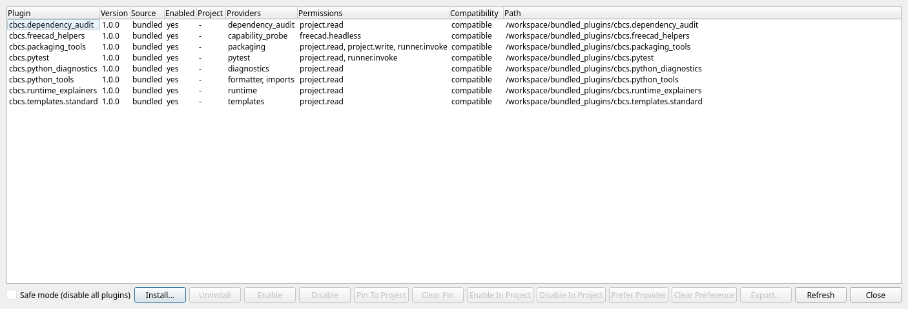

# Authoring Your First Plugin

This chapter walks through creating a minimal plugin, installing it, and confirming it
works. We start with the simplest possible plugin and add a declarative command.

## Plugin package structure

A plugin is a folder containing a `plugin.json` manifest, plus an optional runtime module:

```text
my_plugin/
  plugin.json
  runtime.py        # only needed for runtime commands / workflow providers
```

The installer accepts either:

- a plugin **folder**, or
- a `.zip` archive containing exactly one plugin root with `plugin.json` (distributed with
  the `.cbcs-plugin.zip` extension).

## The smallest valid manifest

```json
{
  "id": "acme.sample",
  "name": "Acme Sample",
  "version": "1.0.0",
  "api_version": 1,
  "contributes": {
    "commands": []
  }
}
```

| Field | Meaning |
| --- | --- |
| `id` | Unique plugin id (use a dotted, namespaced id). |
| `name` | Display name in the Plugin Manager. |
| `version` | Plugin version. |
| `api_version` | The plugin API version the plugin targets (currently `1`). |
| `contributes` | What the plugin adds (commands, workflow providers, event hooks). |

## Adding a declarative command

Declarative commands need no code — they are defined entirely in the manifest. They are
useful for simple menu affordances:

```json
{
  "id": "acme.sample",
  "name": "Acme Sample",
  "version": "1.0.0",
  "api_version": 1,
  "contributes": {
    "commands": [
      {
        "id": "acme.sample.hello",
        "title": "Acme: Say Hello",
        "menu_id": "tools",
        "shortcut": "",
        "status_tip": "Show a friendly message",
        "message": "Hello from the Acme Sample plugin!"
      }
    ]
  }
}
```

Command fields include `id`, `title`, `menu_id`, `shortcut`, `status_tip`, `tool_tip`,
`message`, and (for runtime commands) `runtime`, `runtime_payload`, and
`runtime_handler`.

## Installing your plugin

1. Open **Tools > Plugin Manager...**.
2. Click **Install...**.
3. Select your plugin folder or `.cbcs-plugin.zip`.

The manifest is validated before installation. If it is invalid or violates the safety
rules, installation is blocked with a clear reason.

Once installed, your plugin appears in the Plugin Manager list with its version,
providers, permissions, and compatibility. Your declarative command appears in the menu
you targeted (`tools` in the example above).



## Reacting to editor events

A plugin can run a command in response to shell events using **event hooks**:

```json
"event_hooks": [
  { "event_type": "run_exit", "command_id": "acme.runtime.echo" }
]
```

Supported events are `run_start`, `run_output`, `run_exit`, `project_opened`, and
`project_open_failed`. The event payload is delivered to the runtime command.

## Controlling when your plugin activates

Use **activation events** so your plugin loads only when needed:

- `on_provider:formatter`, `on_provider:diagnostics`, `on_provider:test`
- `on_command:<command_id>`
- `on_event:<event_type>`

## A declarative menu command, in full

Here is a complete declarative-command plugin that adds a Tools-menu item which shows a
message — no runtime code at all:

```json
{
  "id": "acme.hello",
  "name": "Acme Hello",
  "version": "1.0.0",
  "api_version": 1,
  "contributes": {
    "commands": [
      {
        "id": "acme.hello.say",
        "title": "Acme: Say Hello",
        "menu_id": "tools",
        "shortcut": "Ctrl+Alt+H",
        "status_tip": "Show a greeting",
        "tool_tip": "Acme greeting",
        "message": "Hello from Acme!"
      }
    ]
  }
}
```

Install it, and **Tools > Acme: Say Hello** appears (with the shortcut you declared).
Choosing it shows the message. This is the simplest possible extension and needs no Python
code.

## Reacting to a run finishing

Add an event hook to run a command when a run ends:

```json
"event_hooks": [
  { "event_type": "run_exit", "command_id": "acme.hello.say" }
]
```

Now your command fires automatically after each run. Supported events are `run_start`,
`run_output`, `run_exit`, `project_opened`, and `project_open_failed`. The event payload is
passed to a runtime command if the command is backed by code.

## Iterating on a plugin

While developing, you will edit and re-test repeatedly:

1. Make changes to the plugin folder.
2. In the Plugin Manager, **Uninstall** the old version and **Install** the updated folder
   (or use **Refresh**).
3. Trigger your command/workflow and observe the result.
4. If the plugin misbehaves, the host process isolates the failure — fix and reinstall.

## Safety rules to follow

- Keep imports at module top-level.
- Ship pure Python only (no native extensions).
- Do not assume a terminal or arbitrary binaries.
- Do not create hidden directories (such as `.cbcs` or `.pytest_cache`).
- For formatting/refactoring flows, return structured results and let the editor apply
  the edits — do not write project files directly.

## Where to go next

- Add real logic with a runtime module and workflow providers in "Runtime plugins &
  workflow providers".
- Look up the exact contracts in "Plugin API reference & distribution".
