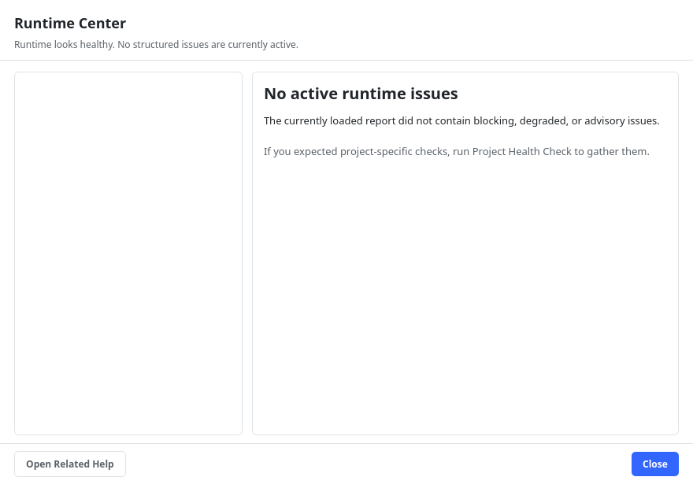

# Diagnostics & Support Tools

ChoreBoy Code Studio includes tools that explain its own state and help you (or a
supporter) diagnose problems — all without a terminal. This chapter covers the Runtime
Center, Project Health Check, Support Bundle, and the application logs.

## The Runtime Center

Open **Tools > Runtime Center...** (or click the runtime-readiness text in the status
bar). The Runtime Center explains, in plain language, whether the runtime and your
project are healthy.

- When everything is fine, it reports that the runtime looks healthy with no active
  issues.
- When something is wrong, it lists each issue as **blocking**, **degraded**, or
  **advisory**, with an explanation and next steps.
- **Open Related Help** links to deeper guidance for the current topic.

The Runtime Center is the place to look first whenever the status bar shows
"Runtime issues".

## Project Health Check

Choose **Tools > Project Health Check** to scan the open project for common problems —
for example, a missing entry file, an invalid configuration, or unresolved imports. The
results appear in understandable terms with suggested fixes, and feed into the Runtime
Center.

## Generating a Support Bundle

When you need help, choose **Tools > Generate Support Bundle**. This packages diagnostic
information into a single archive you can copy to a USB drive and share. The bundle
typically includes:

- the application log (`app.log`),
- project metadata,
- the most recent run log,
- a machine-readable snapshot of the runtime explanation shown in the Runtime Center,
- plugin and provider state (including `cbcs/plugins.json` when present) and recent
  plugin/provider failures.

> [!NOTE] The Support Bundle is designed for offline transfer. It contains enough context
> for a supporter to understand the problem without reproducing your exact session.

## The application logs

ChoreBoy Code Studio always writes a log of its own activity:

- **Help > Open Application Log** opens `app.log` in an editor tab.
- **Help > Open Log Folder** reveals the global logs folder in the file manager.

The editor log lives at `~/choreboy_code_studio_state/logs/app.log`. Each run also writes
a per-run log to `<project>/cbcs/logs/`. Logs include timestamps, levels, and the
subsystem that produced each message, and tracebacks are preserved in full.

> [!TIP] If a run failed and you closed the application, you can still read exactly what
> happened in the saved per-run log — nothing is lost when the window closes.

## Refreshing runtime knowledge

Two Tools commands re-probe the environment when needed:

- **Refresh Runtime Modules** re-checks which Python modules are importable in the
  runtime (useful after vendoring a dependency).
- **Rebuild Intelligence Cache** rebuilds the symbol index used by code intelligence.

## Where to go next

- Fix specific problems in "Troubleshooting by symptom".
- Understand the runtime model in Part V, "How it works".
